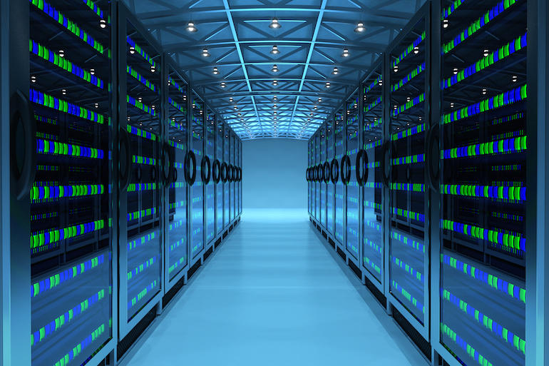
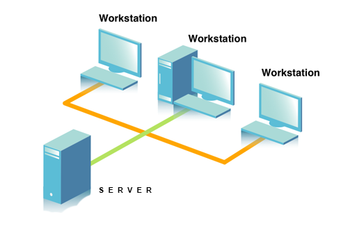
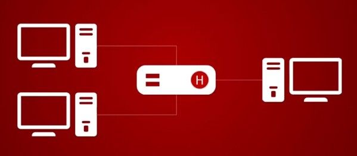
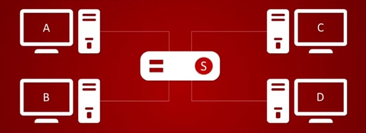
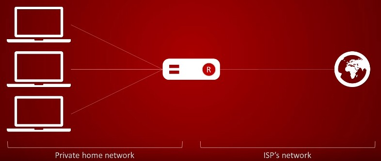
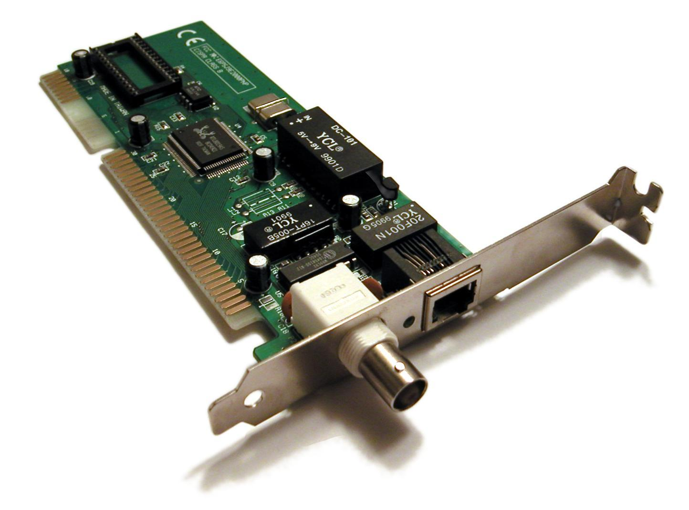
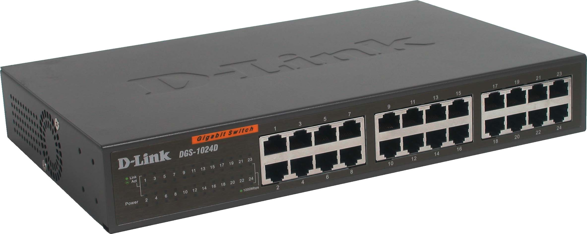
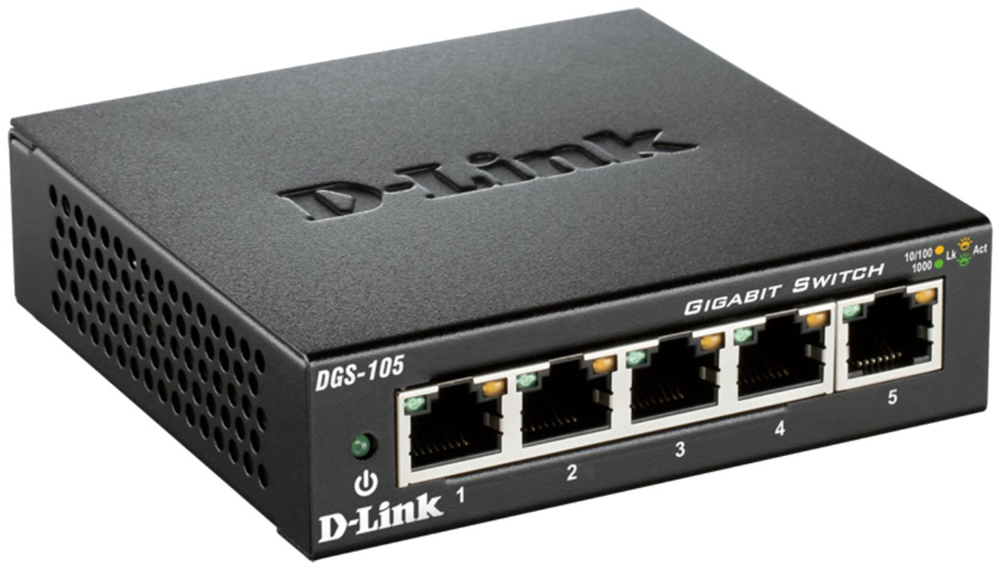
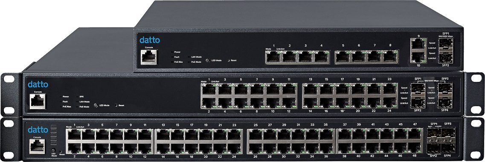

autoscale: true
build-lists: true
slidenumbers: true
footer: *Managing Networks*
<!-- slide-dividers: # -->

### Unit 5

# Managing Networks

- Keshav Dulal

---

# Learning Outcomes

1. Know about networking management tools and technologies
1. Understand network management functions
1. Be able to carry out network management activities

---

# 1. Know about networking management tools and technologies.

1. Network Technologies
1. Network Management Tools

---

# Network Technologies

1. Network Operating Systems
1. Network Protocols
1. Network Layout
1. Network Devices

---

# 1. Network Operating Systems

- Windows
- Linux
- MAC OS

---

# 2. Network Protocols

- Application Layer Protocols
- SNMPv3
  - Simple Network Message Protocol
- ICMP
  -Internet Control Message Protocol

---

# 3. Network Layout

- Cabling
- Topologies
- Wireless Networks

---

# 4. Network Devices

- Servers
- Workstations
- Interconnection devices
- Network cards
- Vendor specific hardware

---

## Servers

---

# Workstation

---

# Interconnection Devices

---

# Network Cards

---

# Management Tools

1. GUI Tools
1. Command Line Tools

---

# 1. GUI Tools

- Angry IP Scanner
- WireShark

---

# 2. Command Line Tools

- ping
- traceroute / tracert
- tcpdump
- nmap
- ssh

---

> fin

---

# 1. Know about networking management tools and technologies

- Network technologies
  - Network Operating Systems
    - Windows
    - Linux
  - Network Protocols
    - SNMPv3
    - ICMP
  - Network Layout
    - Cabling
    - Topologies
    - Wireless
  - Network Devices
    - Servers
    - Workstations
    - Interconnection devices
    - Network cards
    - Vendor specific hardware

- Networking tools & purpose
  - Tools
    - HP Openview
    - Cisco Works
    - Wireshark
    - Angry IP
    - Using system software eg to find network assets
  - Purpose
    - Fault management
    - Performance management
- Emerging technologies
  - Server virtualization
  - Video on demand
- Impact of emerging technologies
- Enhanced capabilities
  - Faster
  - Greater storage capacity
  - Improved control
- New work methods
  - Mobile working
  - Home working
  - Web centric applications
  - Ease of use

---

## 2. Understand network management functions

- Network management functions:
  "Network configuration is the process of maintaining and organizing the information of the network components. If the network needs repairing, any modifications, expansions or upgrades the network manager can refer to the NCM database and to decide what the best course of action is. The database contains the locations and network addresses of all hardware devices; it also contains information about the programs, versions and updates installed in network computers.
  Network configuration is a major aspect of setting a network up, the network will be regularly tweaked to improve performance and solve any issues that arise."
  - Configuration management
    - Configuration management is taken to include issues such as change control, hardware inventory mapping, software inventories and customization of systems.
  - Fault management
    - Fault management includes events, alarms, problem identification, troubleshooting, diagnosis and fault logging.
  - Performance management
    - Performance covers capacity planning, availability, response times, accuracy and throughput.
  - Security management
    - Security discusses policy, authorization, exceptions, logging etc.
  - Accounting management
    - Finally, accounting includes asset management, cost controls and payment for services.
- Performance Variables
  - Network throughput
  - User Response Time
  - Line Utilization
  - Other activities eg
    - Planning
    - Designing
    - Installing
  - Network Operations
    - Security
    - Data Logging
    - Checking Performance
    - Traffic
  - Reporting

---

## 3. Be able to carry out network management activities

- Regular maintenance activities
  - Backup and Restore files
  - User account creation and deletion
  - Design and develop login scripts
  - Virus scans
  - File cleanup
- Tools
  - To manage performance or fault find
    - SNMP / HP Openview
- Documentation
  - Work logs
  - Log resources used
  - System testing
- Configuration options
  - User accounts location eg choosing server and setting rights
  - Drive mappings
  - Other eg virus scanning options
- Security features:
  - VPN access
  - Firewall management
  - Access control lists
  - Device hardening
    "In computing, hardening is usually the process of securing a system by reducing its surface of vulnerability, which is larger when a system performs more functions; in principle a single-function system is more secure than a multipurpose one. Reducing available ways of attack typically includes changing default passwords, the removal of unnecessary software, unnecessary usernames or logins, and the disabling or removal of unnecessary services.

    Hardening is the process to eliminate a means of attack by patching vulnerabilities, turning off non-essential services and configuring system with security controls such as password management, file permissions and disabling unused network ports.

    The hardening activities for key management systems involve several steps to form layers of protection."
    - Remove all non-essential services and programs
      - Every program is a potential entry point for a hacker. Cleaning out unnecessary programs and utilities from the computer can reduce the attack surface area. Programs such as FTP, telnet, and Rlogin should not be used. If the program is classified as non-essential for the company, it shouldn’t be allowed because hackers might take advantage by backdoors and security holes. This also involves disabling network ports and services that are no longer required for the operation of the system. Disabling removable media, or disabling automatic run features on removable media and enabling automatic malware checks upon media introduction can also help in reducing the attack surface area of the system.
    - Upgrade and implement latest security patches
      - In the digital age, it is important to realize that there is no perfect security. Vulnerabilities are often discovered in systems and appropriate security patches are released to fix the issue. Patch management is essential for maintaining and improving key management systems security posture. The security policy and standards for the organization should specify the process for obtaining, testing and deploying patches. Testing must be carried out on a confined system before deployment to ensure no functional problems are introduced by the patch
    - Implement Least Privilege on user accounts and file systems
      - Using the principle of least privilege to control access to sensitive system features, application, files and data. This also includes limiting user accounts to those needed for legitimate operations and disabling or removing accounts that are no longer required. The concept of least privilege is an important factor in designing a hardening checklist for servers.
    - Password Management
      - In a hardening checklist, password management includes the use of complex password, password expiry, password re-use period, password maximum days, password minimum length, and password change period. One should note that the hardening checklist should comply with the password policy of the organization. Replacing all default passwords and keys with strong passwords and randomly generated keys (or implement strong authentication, such as smart cards) should be part of the hardening checklist for key management system.
    - Logging and auditing
      - System, application and security logs should be enabled in the server. For example, in a linux server, by default syslog stores data in /var/log/ directory. It is useful to analyze unauthorized access or hacking attempts. Tamper-evident logs are recommended for proof of compliance to internal and/or external requirements.
    - Enabling additional security features and configuration option
      - Additional security features such as Mandatory Access Control (MAC) provided by SELinux can help in enforcing limitation on network and other programs. The hardening checklist for key management system should specify how these features can be enabled and the configuration settings for the process. It is also mandatory to configure and harden services such as SSH or RDP. The SSH hardening should detail how the SSH settings should be configured. The NIST publication on ‘A framework for Designing Cryptographic Key Management System’ recommends enabling optional security features as appropriate and selecting other configuration options that are secure.
  - Continuous policy review
  - Forensic analysis
  - User rights
- Security policies and procedures
  - Periodically review user access and rights
  - Penetration testing
  - Security
  - Audits
  - Review firewall
  - Access control list policies
- Configuration Management

---

<!-- https://www.lonestarracks.com/news/2017/03/16/understanding-network-switches/ -->
# Switches

---

---

---

# Definition

A network switch is a piece of hardware that allows multiple other devices to communicate with each other quickly and easily.

---

## Types of Switches

- UnManaged / Automatic Switches
- Managed / Non-Automatic Switches

---

## Choosing a Network Switch

- Number of Ports / Scalability
- Speed of Switch
- Cost

---

## Advantages

-

## Disadvantages

- Single Point of failure

---

# Purpose of Networking Tool

1. Fault Management
1. Performance Management

---

# 1. Fault Management

---

# 2. Performance Management

---

# Emerging Network Technologies

1. Server Virtualization
1. Video on Demand

---

# 1. Server Virtualization

1. OS Level Virtualization
2. Hardware Level Virtualization

---

# Uses of server virtualization

- Isolate applications
- Extend the life of older applications
- Help move things to the cloud
- Improve disaster recovery
- Increase uptime
- Reduce hardware vendor lock-in
- Faster server provisioning
- Reduce datacenter costs by reducing your physical infrastructure
- improving your server to admin ratio.
- Save cost / energy

---

# 2. Video on Demand (VOD)

---
# Potential Impacts of emerging network technologies.

<!-- how emerging new technologies can change the network world -->
- Enhanced capabilities
  - Faster greater storage capacity
  - Improved controls
- New Work methods
  - Home/remote working
  - Mobile Working (ssh)
- Web Centric Applications
  - Google Docs/Slides
- Ease of use

---

# Impacts of Server Virtualization
- Reduce the no of physical servers
- Reduce the admin to server ratio
- Less physical servers means less power consumption
- Decrease data-center setup cost
- Contradict one server one application rule

---

# Video on Demand

- Ease of USE
- MOOCs (Massive Online Occuring Courses)
- Different business prospect
- Increase in network bandwidth
- Increase in server redundancy/counts/mirrors

---

# Functions of network management

1. Configuration Management
1. Fault Management
1. User Accounts Management
1. Account Management
1. Performance Management
1. Security management

---

# 1. Configuration Management

- managing the equipment in the network
- tracking the equipment in the network
- managing the addition/removal of equipment
- rerouting of traffic
- management of software versions on the equipment
- setting up, taking down, and keeping track of connections (Connection Management)

<!-- 3. Configuration management deals with the set of functions associated with managing orderly changes in a network. The basic function of managing the equipment in the network belongs to this category. This includes tracking the equipment in the network and managing the addition/removal of equipment, including any rerouting of traffic this may involve and the management of software versions on the equipment.

Another aspect of configuration management is connection management, which deals with setting up, taking down, and keeping track of connections in a network. This function can be performed by a centralized management system. Alternatively, it can also be performed by a distributed network control entity. Distributed network control becomes necessary when connection setup/take-down events occur very frequently or when the network is very large and complex.

Finally, the network needs to convert external client signals entering the optical layer into appropriate signals inside the optical layer. This function is adaptation management. -->

---

# 2. Fault Management

- Fault Detection
  - detecting failures when they happen
- Fault Diagnosis & Isolation
  - isolating the failed component
- Restoration
  - restore traffic that may be disrupted due to the failure (if possible)

<!-- Fault management is the function responsible for detecting failures when they happen and isolating the failed component. The network also needs to restore traffic that may be disrupted due to the failure, but this is usually considered a separate function. -->

---
<!-- https://access.redhat.com/documentation/en-US/Red_Hat_Enterprise_Linux/4/html/Introduction_To_System_Administration/ch-acctsgrps.html -->

# 3. User Accounts Management

1. Managing User Accounts
    - The Username
    - Passwords
    - Access Control Information
    - Managing Accounts and Resource Access Day-to-Day
1. Managing User Resources
    - Who Can Access Shared Data
    - Where Users Access Shared Data
    - What Barriers Are in Place To Prevent Abuse of Resources

---

# 4. Account Management

- billing
- tracking records of network components

<!-- 5. Accounting management is the function responsible for billing and for developing lifetime histories of the network components. This function is the same for optical networks. -->

---

# 5. Performance Management

- monitoring and managing the various parameters that measure the performance of the network
- provide quality-of-service
- FUP (fair usage policy)

<!-- Performance management deals with monitoring and managing the various parameters that measure the performance of the network. Performance management is an essential function that enables a service provider to provide quality-of-service guarantees to their clients and to ensure that clients comply with the requirements imposed by the service provider. It is also needed to provide input to other network management functions, in particular, fault management, when anomalous conditions are detected in the network. -->

---

# 6. Security management

- authenticating users
- setting permissions (RWX) on a per-user basis

<!-- 4. Security management includes administrative functions such as authenticating users and setting attributes such as read and write permissions on a per-user basis. From a security perspective, the network is usually partitioned into domains, both horizontally and vertically. Vertical partitioning implies that some users may be allowed to access only certain network elements and not other network elements.

For example, a local craftsperson may be allowed to access only the network elements he is responsible for and not other network elements.

Horizontal partitioning implies that some users may be allowed to access some parameters associated with all the network elements across the network.

For example, a user leasing a lightpath may be provided access to all the performance parameters associated with that lightpath across all the nodes that the light path traverses. Security also involves protecting data belonging to network users from being tapped or corrupted by unauthorized entities. This part of the problem needs to be handled by encrypting the data before transmission and providing the decrypting capability to legitimate users. -->

---

# Goals of Fault Management

1. Fault detection
  The system discovers that service delivery has been interrupted or its performance has degraded.
1. Fault diagnosis and isolation
  The source of the fault, such as a component failure or power outage, and its location in the network topology are identified.
1. Event correlation and aggregation
  Because a single fault can cause multiple alarms, fault management systems often group related events for administrators and provide a root cause analysis.
1. Restoration of service
  The network management system automatically executes any preconfigured scripts or programs to get services up and running as soon as possible.
1. Problem resolution
  The source of the fault is corrected, repaired or replaced. Depending on the cause, manual intervention may be required.

